  

    
  

  <table>
    <tr>
      <td valign="top">
        
      </td>
      <td valign="top">
        
      </td>
    </tr>
  </table>

  

    
  

  

    
    
    
    
  

  

    
    <h3 style="color: #7AA2F7; margin-top: 0; font-family: monospace;">&gt; root@arsenal:~$</h3>
    
    
Languages & Frameworks

    

      
      
      
    

    
Networking & Security

    

      
      
      
    

    
Tools

    

      
      
      
    

  

